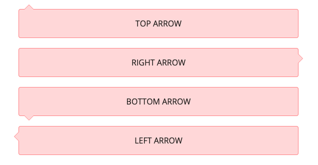

# Tailwind Plugin generating triangle arrows for tooltip-ish divs

## Description

This plugin generates styles for CSS based triangle arrows with configurable border and background via `::after` pseudo-elements.



## Installation

Add this plugin to your project:

```bash
# Install via npm
npm install --save-dev tailwindcss-tooltip-arrow-after
```

## Usage

The plugin configuration accepts multiple objects where each key defines a class suffix for a arrow name. This options 
should be defined in 'theme.tooltipArrows' key in tailwind.config.js

```js
module.exports = {
    //...    
    theme: {
        tooltipArrows: theme => ({
            'danger-arrow': {
                borderColor: theme('colors.red.400'),
                borderWidth: 1,
                backgroundColor: theme('colors.red.200'),
                size: 10,
                offset: 10
            },
        }),
    }
//...
}
```

- `borderColor`: border color
- `borderWidth`: border width (in pixels) e.g. `1` 
- `backgroundColor`: background color 
- `size`: size (in pixels) 
- `offset`: offset (from left to right for top and bottom arrows and from top to bottom for left and right ones) 

Here is the example for adding it to your project plugins

```js
module.exports = {
  // ...
  plugins: [
    // ...
    require('tailwindcss-tooltip-arrow-after')()
  ],
}
```

This configuration would generate classes for all four direction variants of arrows:
- `danger-arrow-top`
- `danger-arrow-right`
- `danger-arrow-bottom`
- `danger-arrow-left`

Example for `danger-error-top` styles:

```css
.danger-arrow-top {
    position: relative;
}

.danger-arrow-top:before, .danger-arrow-top:after {
    content: "";
    position: absolute;
    left: 10px;
    top: -20px;
    border-top: 10px solid transparent;
    border-right: 10px solid transparent;
    border-bottom: 10px solid #fc8181;
    border-left: 10px solid transparent;
}

.danger-arrow-top:after {
  border-bottom: 10px solid #fed7d7;
  top: -19px;
}
```

You can use it in your html

```html
   <div class="danger-arrow-top bg-red-200 p-5 m-5 border-red-400 border border-solid rounded text-center align-content-center">
        TOP ARROW
    </div>
    <div class="danger-arrow-right bg-red-200 p-5 m-5 border-red-400 border border-solid rounded text-center align-content-center">
        RIGHT ARROW
    </div>
    <div class="danger-arrow-bottom bg-red-200 p-5 m-5 border-red-400 border border-solid rounded text-center align-content-center">
        BOTTOM ARROW
    </div>
    <div class="danger-arrow-left bg-red-200 p-5 m-5 border-red-400 border border-solid rounded text-center align-content-center">
        LEFT ARROW
    </div>
```

